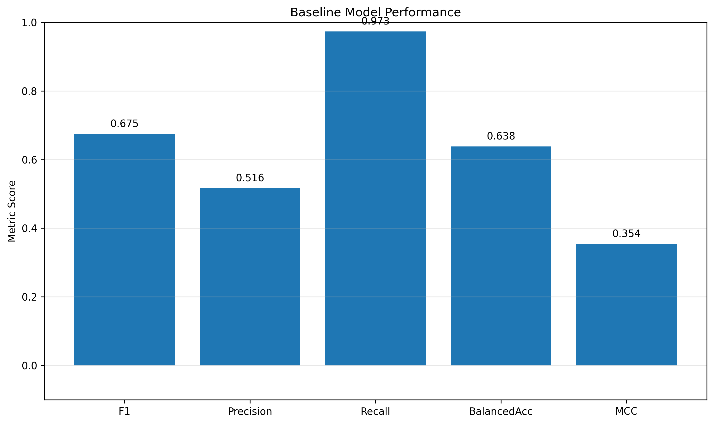

# MLOps Stock Prediction System

[](docs/PIPELINE_EXECUTION.md)
[](docs/API_REPORT.md)
[](docs/DOCKER_REPORT.md)
[](docs/MLFLOW_REPORT.md)
[](docs/gitciwork.md)

## Evaluating Model Drift and Retraining Strategies in an MLOps Pipeline for Stock Market Prediction

---

## Overview

This project presents an end-to-end MLOps pipeline for stock market prediction and investigates how model drift and retraining strategies impact predictive performance over time.

The system combines:

* Data ingestion
* Feature engineering
* Machine learning
* Model explainability
* Backtesting
* Drift monitoring
* Automated retraining
* FastAPI deployment
* Docker containerization
* MLflow experiment tracking

The primary objective is to evaluate whether monitoring and retraining mechanisms help maintain model performance in dynamic financial environments where data distributions continuously evolve.

---

## Project Documentation

Detailed reports for each major component of the project:

- [Pipeline Execution Report](docs/PIPELINE_EXECUTION.md)
- [API Validation Report](docs/API_REPORT.md)
- [Docker Deployment Report](docs/DOCKER_REPORT.md)
- [MLflow Experiment Tracking Report](docs/MLFLOW_REPORT.md)
- [GitHub Actions, CI/CD and Pull Request Validation Report](docs/gitciwork.md)

---

## Research Motivation

Machine learning models deployed in production environments often experience performance degradation due to changes in incoming data distributions.

This phenomenon, known as **model drift**, is particularly common in stock market prediction because:

* Market conditions evolve continuously
* Volatility regimes change frequently
* Investor behavior shifts over time
* Economic conditions introduce new patterns

While predictive models may achieve strong performance during training, maintaining performance after deployment remains a significant challenge.

MLOps practices such as monitoring and retraining offer potential solutions, but their effectiveness and operational trade-offs require empirical evaluation.

---

## Research Questions

### RQ1

How do different model drift detection and retraining strategies affect the performance of a stock prediction model over time?

### RQ2

Does retraining the model on a fixed schedule or only when drift is detected lead to better performance?

### RQ3

What are the trade-offs between model accuracy and system complexity when adding monitoring and retraining?

---

## Key Contributions

This project contributes:

* End-to-end MLOps pipeline implementation
* Automated drift detection framework
* Scheduled retraining strategy
* Drift-triggered retraining strategy
* SHAP explainability analysis
* Financial backtesting evaluation
* Market regime performance analysis
* FastAPI deployment layer
* Dockerized deployment workflow
* MLflow experiment tracking

---

## System Architecture

```text
Market Data
     │
     V
Data Pipeline
     │
     V
Feature Engineering
     │
     V
Model Training
     │
     V
Model Evaluation
     │
     V
FastAPI Deployment
     │
     V
Monitoring
     │
     V
Drift Detection
     │
     V
Retraining
```

---

## Technology Stack

| Component      | Technology                                               |
| -------------- | -------------------------------------------------------- |
| Language       | Python                                                   |
| ML Models      | XGBoost, Random Forest, Extra Trees, Logistic Regression |
| API            | FastAPI                                                  |
| Tracking       | MLflow                                                   |
| Versioning     | Git + DVC                                                |
| Explainability | SHAP                                                     |
| Testing        | Pytest                                                   |
| Linting        | Ruff                                                     |
| Formatting     | Black                                                    |
| Deployment     | Docker                                                   |
| CI/CD          | GitHub Actions                                           |

---

## Project Structure

```text
mlops-stock-project/
│
├── data/
├── dockerfiles/
├── reports/
│   ├── api/
│   ├── docker/
│   ├── explainability/
│   ├── monitoring/
│   └── figures/
│
├── src/mlops_stock_project/
│   ├── api/
│   ├── data/
│   ├── features/
│   ├── models/
│   ├── monitoring/
│   ├── explainability/
│   ├── backtesting/
│   └── evaluation/
│
├── tests/
├── notebooks/
├── Makefile
├── requirements.txt
└── README.md
```

---

## Dataset

Historical stock market data was collected for major technology stocks including:

* Apple (AAPL)
* Microsoft (MSFT)
* Nvidia (NVDA)
* Amazon (AMZN)
* Google (GOOGL)
* Meta (META)
* Tesla (TSLA)

Additional market indicators included:

* SPY
* QQQ
* VIX

---

## Feature Engineering

### Price-Based Features

* Daily Returns
* Lagged Returns
* Momentum Indicators
* Moving Averages
* Exponential Moving Averages

### Volatility Features

* Rolling Volatility
* Bollinger Bands

### Market Features

* SPY Returns
* QQQ Returns
* Relative Market Strength
* Market Stress Indicators

### Regime Features

* High VIX Regime
* Market Volatility State

---

## Model Development

Several machine learning models were evaluated:

* Logistic Regression
* Random Forest
* Extra Trees
* XGBoost

XGBoost achieved the strongest overall performance and was selected as the production model.

---

## Baseline Model Performance



| Metric    | Score |
| --------- | ----- |
| F1 Score  | 0.725 |
| Precision | 0.875 |
| Recall    | 0.619 |

### Interpretation

The baseline model achieved strong precision while maintaining reasonable recall.

This behavior is desirable in trading systems where minimizing false-positive trade signals is often more important than maximizing trade frequency.

The baseline serves as the reference point for evaluating monitoring and retraining strategies.

---

## Explainability Analysis

### SHAP Feature Importance


The most influential features were:

1. SPY Volatility
2. SPY Moving Average
3. QQQ Moving Average
4. VIX Level
5. RSI

### Key Finding

Market-wide indicators contributed more heavily to predictive performance than individual stock-specific variables.

This suggests that overall market conditions play a dominant role in stock direction prediction.

---

### SHAP Summary Plot


The SHAP summary plot illustrates both feature importance and directional impact on model predictions, improving transparency and interpretability.

---

## Backtesting Results

### Strategy vs Buy-and-Hold


### Results

| Portfolio       | Final Value |
| --------------- | ----------- |
| Initial Capital | $10,000     |
| Buy & Hold      | ~$20,500    |
| ML Strategy     | ~$43,000    |

### Interpretation

The model-driven strategy substantially outperformed the benchmark buy-and-hold approach within the historical evaluation period.

While historical performance does not guarantee future returns, these results demonstrate the practical value of the predictive signals generated by the model.

---

## Market Regime Analysis


| Market Regime     | F1 Score |
| ----------------- | -------- |
| High Volatility   | ~0.92    |
| Medium Volatility | ~0.83    |
| Low Volatility    | ~0.72    |

### Key Finding

Model performance improved significantly during periods of elevated volatility.

This suggests stronger predictive signals emerge during turbulent market conditions compared to calm market environments.

---

## Drift Detection and Retraining

### Drift-Triggered Retraining


The monitoring system continuously evaluates incoming data distributions.

When statistically significant drift is detected, retraining is triggered automatically.

#### Observation

Performance remained relatively stable over time, demonstrating the effectiveness of adaptive retraining.

---

### Scheduled Retraining


A fixed retraining schedule was also evaluated.

#### Observation

Scheduled retraining successfully maintained model performance but may retrain unnecessarily when no meaningful drift exists.

---

## Research Findings

### RQ1: How do different model drift detection and retraining strategies affect model performance over time?

Monitoring and retraining successfully maintained predictive performance after deployment by adapting the model to evolving market conditions.

---

### RQ2: Does scheduled or drift-triggered retraining perform better?

Both approaches achieved comparable predictive performance.

However, drift-triggered retraining reduced unnecessary retraining events and therefore provided greater operational efficiency.

---

### RQ3: What are the trade-offs between accuracy and system complexity?

| Approach                   | Accuracy | Complexity |
| -------------------------- | -------- | ---------- |
| Baseline Model             | Moderate | Low        |
| Scheduled Retraining       | Stable   | Medium     |
| Drift-Triggered Retraining | Stable   | High       |

Drift-triggered retraining introduces additional monitoring complexity but provides improved efficiency and adaptability.

---

## Conclusion

This study demonstrates that integrating monitoring and retraining mechanisms into an MLOps pipeline can help maintain predictive performance in dynamic financial environments.

While both scheduled and drift-triggered retraining strategies proved effective, drift-triggered retraining achieved comparable performance with greater operational efficiency by retraining only when statistically significant distribution changes were detected.

The findings support the adoption of monitoring-driven retraining workflows for long-term maintenance of production machine learning systems.

---

## Reproducing Results

Run the complete pipeline:

```bash
make fetch-data
make build-features
make train
make shap
make backtest
make regime
make drift
make retrain
```

Launch the API:

```bash
make run-api
```

Build Docker image:

```bash
make docker-build
```

Run Docker container:

```bash
make docker-run
```

---

## Additional Documentation

| Document | Description |
|----------|-------------|
| [PIPELINE_EXECUTION.md](docs/PIPELINE_EXECUTION.md) | Complete end-to-end pipeline execution with screenshots and results |
| [API_REPORT.md](docs/API_REPORT.md) | FastAPI endpoint testing and validation |
| [DOCKER_REPORT.md](docs/DOCKER_REPORT.md) | Docker deployment and container validation |
| [MLFLOW_REPORT.md](docs/MLFLOW_REPORT.md) | Experiment tracking and model registry details |
| [gitciwork.md](docs/gitciwork.md) | GitHub Actions workflows, CI/CD validation, Pull Request checks, CML reporting, and DockerHub deployment |

---

## Author

**Nishanth Shastry**
<br>Master of Science in Computer Science
<br>DePaul University

---

### Keywords

MLOps - Machine Learning - Model Drift - Retraining - Stock Market Prediction - XGBoost - SHAP - FastAPI - Docker - MLflow - Financial Machine Learning
