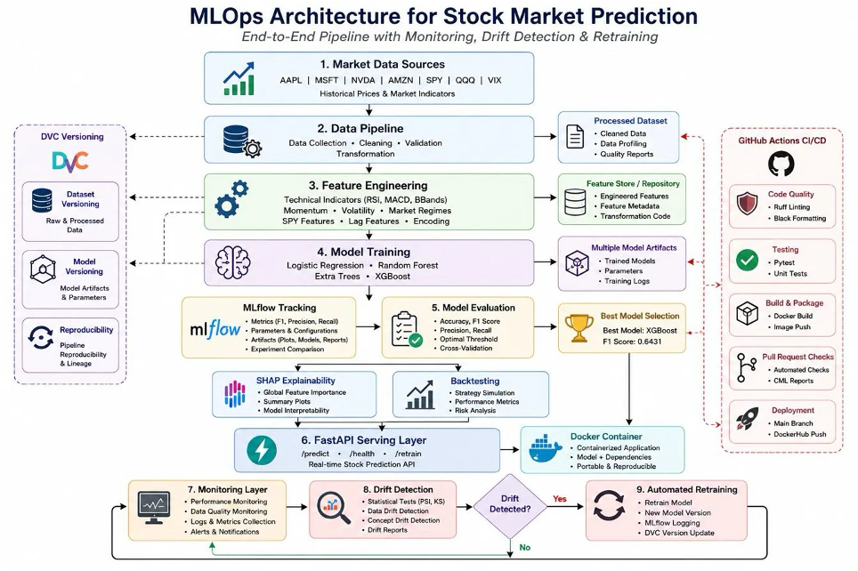
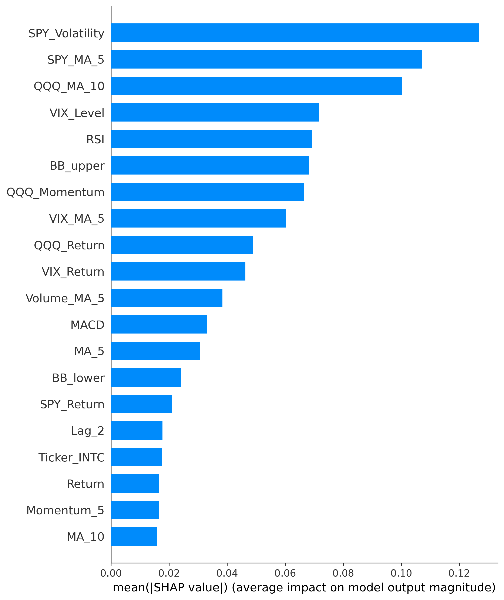
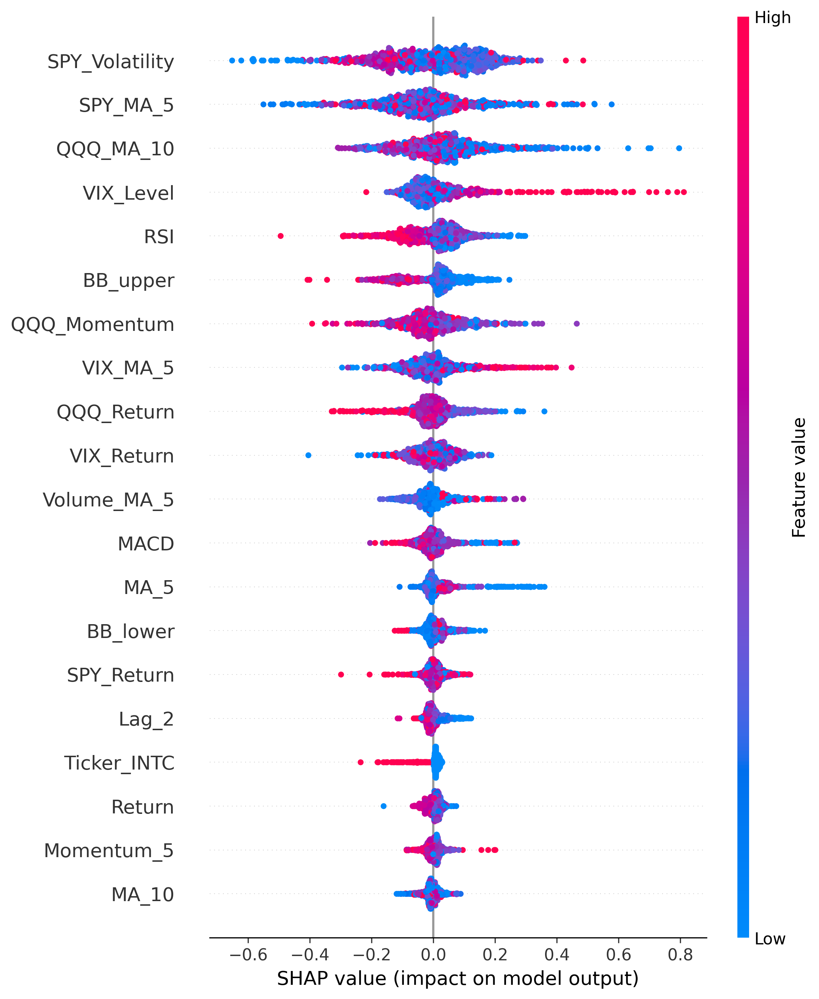
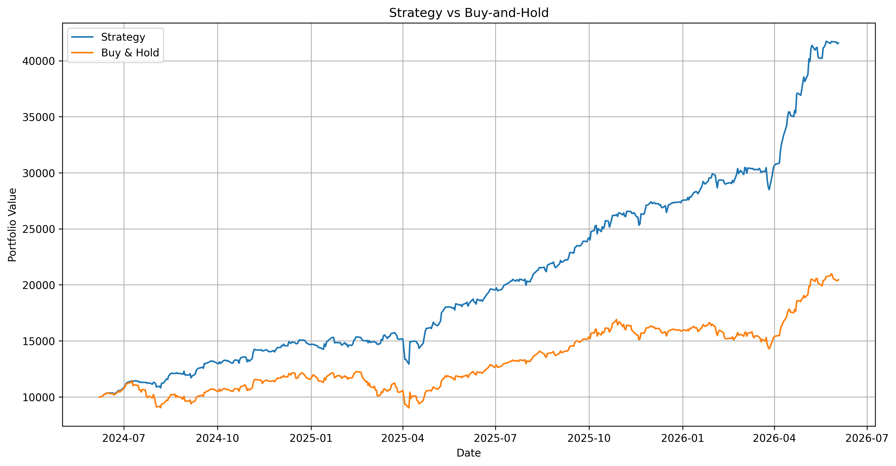
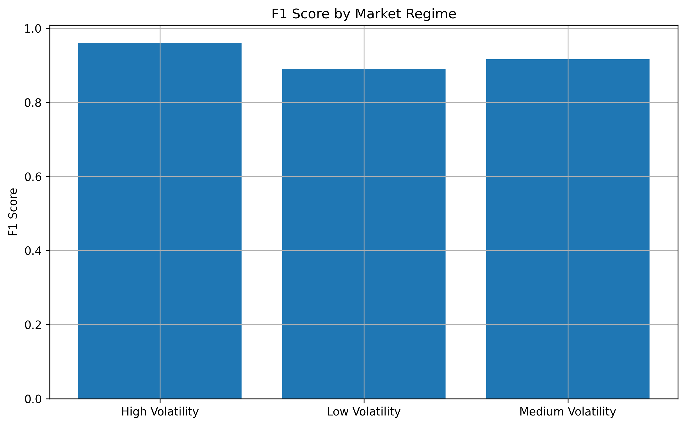
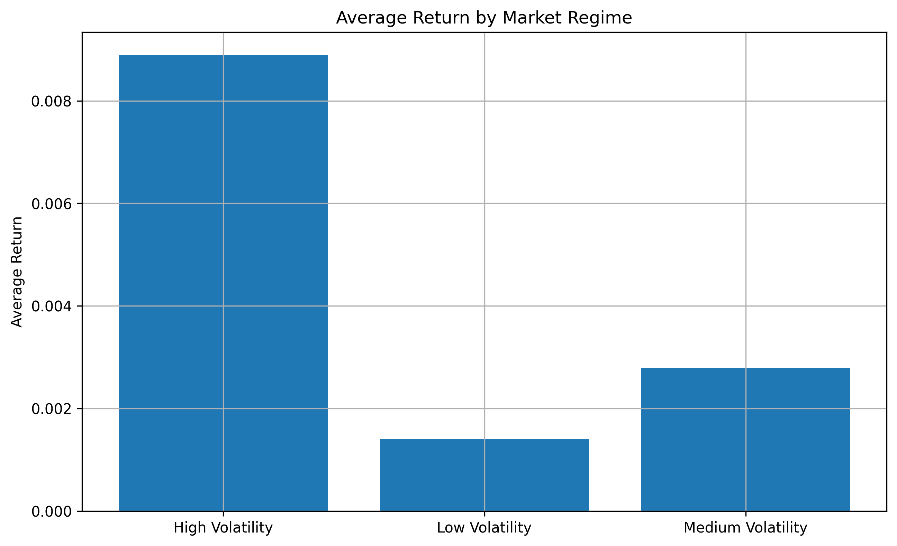
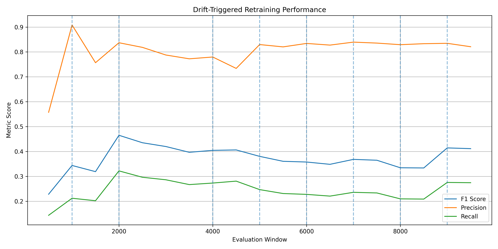
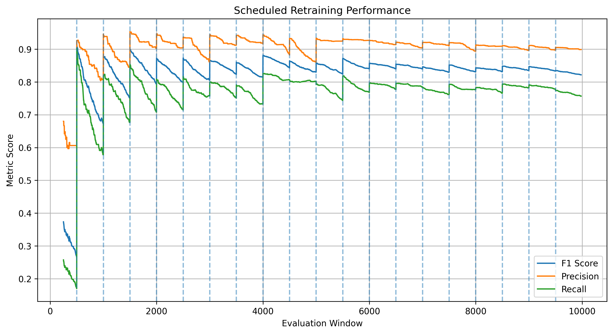
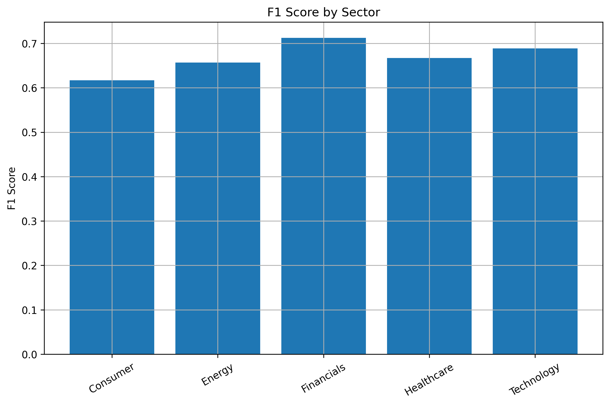

# MLOps Stock Prediction System

[](docs/PIPELINE_EXECUTION.md)
[](docs/API_REPORT.md)
[](docs/DOCKER_REPORT.md)
[](docs/MLFLOW_REPORT.md)
[](docs/gitciwork.md)

## Evaluating Model Drift and Retraining Strategies in an MLOps Pipeline for Stock Market Prediction

---

## Overview

This project presents an end-to-end MLOps pipeline for stock market prediction and investigates how model drift and retraining strategies impact predictive performance over time.

The system combines:

* Data ingestion
* Feature engineering
* Machine learning
* Model explainability
* Backtesting
* Drift monitoring
* Automated retraining
* FastAPI deployment
* Docker containerization
* MLflow experiment tracking

The primary objective is to evaluate whether monitoring and retraining mechanisms help maintain model performance in dynamic financial environments where data distributions continuously evolve.

---

## Project Evolution and Response to Project Review

This repository represents the final version of the MLOps Stock Prediction Platform after incorporating observations and recommendations from project review discussions.

The original version of the project implemented an end-to-end MLOps pipeline for stock market prediction, including data ingestion, feature engineering, model training, FastAPI deployment, Docker containerization, MLflow tracking, monitoring, and automated retraining workflows. The project primarily focused on predicting stock movements for a portfolio of large-cap technology companies using market and technical indicators.

During project review, several important observations were raised regarding both the machine learning model and the research scope of the study.

### Observation 1: Limited Dataset Diversity

The original dataset consisted primarily of large-cap technology companies. Since these stocks often move together and are highly correlated with broader market indices, there was concern that the model might be learning general market behavior rather than stock-specific patterns.

#### Actions Taken

* Expanded the stock universe beyond technology companies.
* Added Healthcare, Financial, Energy, and Consumer sector stocks.
* Increased sector diversity to improve model generalizability.
* Added sector-level evaluation and performance reporting.

#### Outcome

The expanded dataset enabled analysis across multiple industries and provided a stronger basis for evaluating whether the model could generalize beyond a technology-focused portfolio.

---

### Observation 2: Market-Wide Features Appeared Dominant

Review discussions highlighted that features derived from SPY, QQQ, and VIX appeared to contribute heavily to predictions, raising questions about whether the model relied primarily on overall market behavior.

#### Actions Taken

* Performed detailed SHAP explainability analysis.
* Quantified the importance of market-wide indicators.
* Introduced sector-aware analysis to compare market and sector influences.

#### Outcome

SHAP analysis confirmed that market-wide indicators remain highly influential predictors, supporting the hypothesis that broader market conditions play a major role in stock direction forecasting.

---

### Observation 3: Class Imbalance Can Affect Interpretation of F1 Score

Review discussions noted that stock prices tend to rise more frequently than they fall, which can lead to class imbalance and potentially inflate performance metrics.

#### Actions Taken

* Added threshold optimization rather than relying on the default 0.50 classification threshold.
* Evaluated additional metrics including Precision, Recall, Balanced Accuracy, MCC, Sharpe Ratio, and Win Rate.
* Documented class imbalance considerations throughout model evaluation.

#### Outcome

The analysis provided a more comprehensive view of model performance and reduced reliance on a single evaluation metric.

---

### Observation 4: Retraining Strategies Required Further Evaluation

A central research question of the project was whether retraining on a fixed schedule or only when drift is detected would provide better operational outcomes.

#### Actions Taken

* Implemented automated drift monitoring using PSI and KS-statistic based drift detection.
* Developed a scheduled retraining simulation.
* Developed a drift-triggered retraining simulation.
* Compared model performance and retraining frequency across both approaches.

#### Outcome

Both retraining strategies achieved similar predictive performance. However, drift-triggered retraining required fewer retraining events, suggesting greater operational efficiency while maintaining comparable accuracy.

---

### Resulting Research Scope

These enhancements transformed the project from a traditional stock prediction pipeline into a broader study of model drift, monitoring, explainability, retraining strategies, and model generalization within a production-oriented MLOps environment.

The original project submission has been preserved in the `main-old` branch, while the current `main` branch contains the enhanced version incorporating additional experimentation, analysis, and evaluation.

**Original Version:** https://github.com/nishanthshastry/mlops-stock-project/tree/main-old

### Repository Branches

| Branch   | Purpose                                                                                |
| -------- | -------------------------------------------------------------------------------------- |
| main-old | Original project submission                                                            |
| main     | Enhanced version incorporating review-driven improvements and extended experimentation |

---

## Project Documentation

Detailed reports for each major component of the project:

- [Pipeline Execution Report](docs/PIPELINE_EXECUTION.md)
- [API Validation Report](docs/API_REPORT.md)
- [Docker Deployment Report](docs/DOCKER_REPORT.md)
- [MLflow Experiment Tracking Report](docs/MLFLOW_REPORT.md)
- [GitHub Actions, CI/CD and Pull Request Validation Report](docs/gitciwork.md)

---

## Research Motivation

Machine learning models deployed in production environments often experience performance degradation due to changes in incoming data distributions.

This phenomenon, known as **model drift**, is particularly common in stock market prediction because:

* Market conditions evolve continuously
* Volatility regimes change frequently
* Investor behavior shifts over time
* Economic conditions introduce new patterns

While predictive models may achieve strong performance during training, maintaining performance after deployment remains a significant challenge.

MLOps practices such as monitoring and retraining offer potential solutions, but their effectiveness and operational trade-offs require empirical evaluation.

---

## Research Questions

### RQ1

How do different model drift detection and retraining strategies affect the performance of a stock prediction model over time?

### RQ2

Does retraining the model on a fixed schedule or only when drift is detected lead to better performance?

### RQ3

What are the trade-offs between model accuracy and system complexity when adding monitoring and retraining?

---

## Key Contributions

This project contributes:

* End-to-end MLOps pipeline implementation
* Automated drift detection framework
* Scheduled retraining strategy
* Drift-triggered retraining strategy
* SHAP explainability analysis
* Financial backtesting evaluation
* Market regime performance analysis
* FastAPI deployment layer
* Data versioning with DVC
* Dockerized deployment workflow
* MLflow experiment tracking
* Automated CI/CD validation pipeline

---

## Pipeline Architecture



---

## Technology Stack

| Component      | Technology                                               |
| -------------- | -------------------------------------------------------- |
| Language       | Python                                                   |
| ML Models      | XGBoost, Random Forest, Extra Trees, Logistic Regression |
| API            | FastAPI                                                  |
| Tracking       | MLflow                                                   |
| Versioning     | Git + DVC                                                |
| Explainability | SHAP                                                     |
| Testing        | Pytest                                                   |
| Linting        | Ruff                                                     |
| Formatting     | Black                                                    |
| Deployment     | Docker                                                   |
| CI/CD          | GitHub Actions                                           |

---

## Project Structure

```text
mlops-stock-project/
│
├── data/
├── dockerfiles/
├── reports/
│   ├── api/
│   ├── docker/
│   ├── explainability/
│   ├── monitoring/
│   └── figures/
│
├── src/mlops_stock_project/
│   ├── api/
│   ├── data/
│   ├── features/
│   ├── models/
│   ├── monitoring/
│   ├── explainability/
│   ├── backtesting/
│   └── evaluation/
│
├── tests/
├── notebooks/
├── Makefile
├── requirements.txt
└── README.md
```

---

## Dataset

Historical market data was collected for 22 large-cap U.S. equities spanning multiple sectors:

### Technology
- AAPL
- MSFT
- NVDA
- AMD
- AMZN
- META
- GOOGL
- NFLX
- TSLA
- INTC

### Healthcare
- JNJ
- PFE
- MRK
- ABBV

### Financials
- JPM
- BAC
- GS

### Energy
- XOM
- CVX

### Consumer
- WMT
- COST
- PG

In addition to stock-level data, market-wide indicators were incorporated:

- SPY
- QQQ
- VIX

The final dataset was engineered into a feature-rich time-series classification problem for predicting future market direction.

---

## Feature Engineering

### Price-Based Features

* Daily Returns
* Lagged Returns
* Momentum Indicators
* Moving Averages
* Exponential Moving Averages

### Volatility Features

* Rolling Volatility
* Bollinger Bands

### Market Features

* SPY Returns
* QQQ Returns
* Relative Market Strength
* Market Stress Indicators

### Regime Features

* High VIX Regime
* Market Volatility State

---

## Model Development

Several machine learning models were evaluated:

* Logistic Regression
* Random Forest
* Extra Trees
* XGBoost

XGBoost achieved the strongest overall performance and was selected as the production model.

---

## Baseline Model Performance


| Metric             | Score |
|-------------------|--------|
| F1 Score          | 0.675 |
| Precision         | 0.516 |
| Recall            | 0.973 |
| Balanced Accuracy | 0.638 |
| MCC               | 0.354 |

### Interpretation

The baseline model achieved extremely high recall (0.973) but relatively low precision (0.516).

This indicates that the model successfully identifies most positive market movements but also generates a larger number of false-positive trading signals.

The resulting F1 score of 0.675 reflects a balance between aggressive signal generation and prediction accuracy.

---

## Explainability Analysis

### SHAP Feature Importance



The most influential features were:

1. QQQ_MA_10
2. SPY_MA_5
3. VIX_Level
4. SPY_Volatility
5. VIX_MA_5
6. QQQ_Momentum
7. Sector_Healthcare
8. VIX_Return
9. QQQ_Return
10. Volume_MA_5

### Key Finding

The most influential features were dominated by market-wide indicators such as QQQ moving averages, SPY moving averages, VIX levels, and market volatility measures.

This suggests that broad market conditions contribute more strongly to predictive performance than individual stock-specific characteristics.

---

### SHAP Summary Plot



The SHAP summary plot illustrates both feature importance and directional impact on model predictions, improving transparency and interpretability.

---

## Backtesting Results

### Strategy vs Buy-and-Hold



### Results

Initial Capital: $10,000
Strategy Final Value: ~$24,200
Buy & Hold Final Value: ~$16,800

| Metric | Result |
|---------|---------|
| Strategy Return | 142.03% |
| Market Return | 67.85% |
| Sharpe Ratio | 3.09 |
| Max Drawdown | -12.02% |
| Win Rate | 59.44% |

The model-driven strategy substantially outperformed the buy-and-hold benchmark, more than doubling market returns while maintaining a strong risk-adjusted Sharpe ratio.

### Interpretation

The model-driven strategy substantially outperformed the benchmark buy-and-hold approach within the historical evaluation period.

While historical performance does not guarantee future returns, these results demonstrate the practical value of the predictive signals generated by the model.

---

## Market Regime Analysis

**Market Regime Performance**



**Market Regime Returns**



| Market Regime | Samples | F1 Score |
|---------------|---------|----------|
| High Volatility | 330 | 0.81 |
| Medium Volatility | 2398 | 0.74 |
| Low Volatility | 8228 | 0.65 |

### Key Finding

The model performs best during periods of elevated volatility.

Higher volatility appears to generate stronger directional signals, improving classification performance and trading outcomes.

---

## Drift Detection and Retraining

### Drift-Triggered Retraining



The monitoring system continuously evaluates incoming data distributions.

When statistically significant drift is detected, retraining is triggered automatically.

#### Observation

The monitoring system detected only moderate feature drift.

Observed PSI values were generally below the retraining threshold, with the highest monitored features showing moderate distribution shifts:

- Volatility PSI = 0.202
- Relative_SPY_Volatility PSI = 0.209
- Relative_VIX_Level PSI = 0.219

No feature exceeded the configured retraining threshold of 0.25, and no automatic retraining was triggered during monitoring evaluation.

---

### Scheduled Retraining



A fixed retraining schedule was also evaluated.

#### Observation

Scheduled retraining successfully maintained model performance but may retrain unnecessarily when no meaningful drift exists.

---

## Sector Performance Analysis



| Sector | Approximate F1 Score |
|---------|---------|
| Consumer | 0.62 |
| Energy | 0.66 |
| Financials | 0.71 |
| Healthcare | 0.67 |
| Technology | 0.69 |

### Key Finding

Model performance remained relatively consistent across sectors, with Financials and Technology producing the strongest predictive performance.

This suggests that the model generalizes reasonably well across multiple market sectors rather than relying solely on technology stocks.

---

## Model Comparison

Four machine learning algorithms were evaluated:

- Logistic Regression
- Random Forest
- Extra Trees
- XGBoost

XGBoost achieved the strongest overall balance between recall, precision, and F1 score and was therefore selected as the production model used throughout the monitoring and retraining experiments.

---

## Research Findings

### RQ1: How do different model drift detection and retraining strategies affect model performance over time?

Both monitoring-based approaches successfully maintained predictive performance over time.

The evaluated stock dataset exhibited only moderate distribution shifts, resulting in limited degradation of model performance.

Retraining mechanisms therefore produced stable results but did not generate large performance improvements.

---

### RQ2: Does scheduled or drift-triggered retraining perform better?

Scheduled and drift-triggered retraining achieved comparable predictive performance throughout the simulation experiments.

However, drift-triggered retraining reduced unnecessary retraining operations by activating only when monitored drift thresholds were exceeded.

This suggests that monitoring-driven retraining can achieve similar predictive quality with lower operational overhead.

---

### RQ3: What are the trade-offs between model accuracy and system complexity?

| Approach | Accuracy | Operational Complexity |
|-----------|-----------|------------------------|
| Baseline Model | Moderate | Low |
| Scheduled Retraining | Stable | Medium |
| Drift-Triggered Retraining | Stable | High |

Drift-triggered retraining requires additional monitoring infrastructure, statistical testing, reporting, and automation logic.

While predictive performance remained similar to scheduled retraining in this study, the approach offers improved governance, auditability, and retraining efficiency.

---

## Final Results Summary

| Component | Result |
|------------|---------|
| Production Model | XGBoost |
| F1 Score | 0.675 |
| Recall | 0.973 |
| Strategy Return | 142.03% |
| Buy & Hold Return | 67.85% |
| Best Regime | High Volatility |
| Top Feature | QQQ_MA_10 |
| Drift Detected | Moderate |
| Retraining Triggered | No |

---

## Conclusion

This project developed a complete end-to-end MLOps pipeline for stock market prediction, incorporating data ingestion, feature engineering, model training, explainability, backtesting, deployment, monitoring, and automated retraining.

Experimental results demonstrated that:

- XGBoost achieved the strongest predictive performance among evaluated models.
- Market-wide indicators such as SPY, QQQ, and VIX were the most influential predictors according to SHAP analysis.
- The trading strategy significantly outperformed a buy-and-hold benchmark during historical backtesting.
- Predictive performance improved during periods of elevated market volatility.
- Only moderate production drift was observed in the evaluated dataset.
- Scheduled and drift-triggered retraining achieved comparable predictive performance.
- Drift-triggered retraining reduced unnecessary retraining operations while maintaining model quality.

Overall, the findings suggest that monitoring-driven retraining provides a practical balance between predictive performance and operational efficiency. Although the observed drift levels were not severe enough to produce substantial accuracy differences, the monitoring framework provides valuable automation, governance, and adaptability for long-term machine learning system maintenance.

---

## Reproducing Results

Run the complete pipeline:

```bash
make fetch-data
make build-features
make train
make shap
make backtest
make regime
make drift
make retrain
```

Launch the API:

```bash
make run-api
```

Build Docker image:

```bash
make docker-build
```

Run Docker container:

```bash
make docker-run
```

---

## Additional Documentation

| Document | Description |
|----------|-------------|
| [PIPELINE_EXECUTION.md](docs/PIPELINE_EXECUTION.md) | Complete end-to-end pipeline execution with screenshots and results |
| [API_REPORT.md](docs/API_REPORT.md) | FastAPI endpoint testing and validation |
| [DOCKER_REPORT.md](docs/DOCKER_REPORT.md) | Docker deployment and container validation |
| [MLFLOW_REPORT.md](docs/MLFLOW_REPORT.md) | Experiment tracking and model registry details |
| [gitciwork.md](docs/gitciwork.md) | GitHub Actions workflows, CI/CD validation, Pull Request checks, CML reporting, and DockerHub deployment |

---

## Author

**Nishanth Shastry**
<br>Master of Science in Computer Science
<br>DePaul University

---

### Keywords

MLOps - Machine Learning - Model Drift - Retraining - Stock Market Prediction - XGBoost - SHAP - FastAPI - Docker - MLflow - Financial Machine Learning
