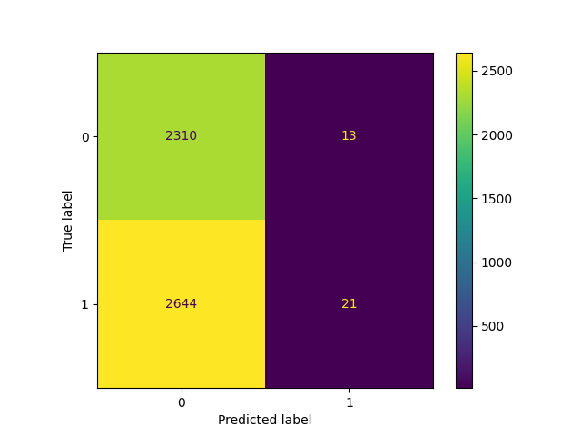
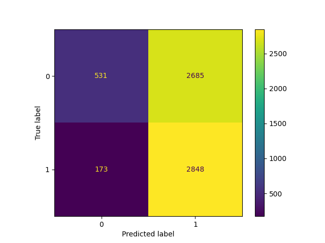
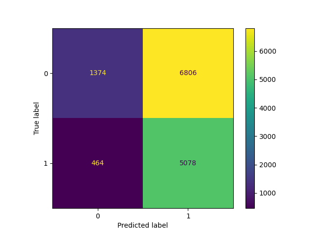
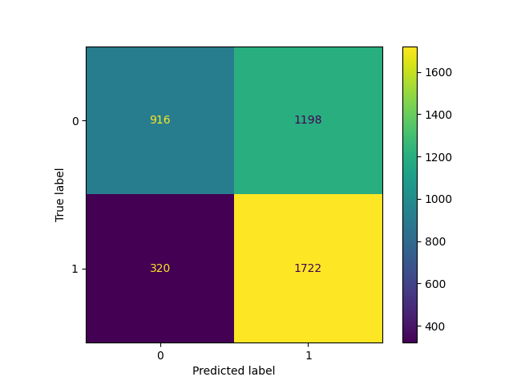

# MLOps Stock Prediction System

An end-to-end MLOps platform for stock movement prediction using machine learning, explainable AI, automated monitoring, retraining workflows, and production-grade deployment practices.

---

## Overview

The MLOps Stock Prediction System is a production-oriented machine learning platform that predicts next-day stock movement across multiple technology stocks.

The project combines:

- Machine Learning
- Financial Feature Engineering
- Explainable AI (SHAP)
- Backtesting & Strategy Evaluation
- Market Regime Analysis
- Drift Detection
- Automated Retraining
- FastAPI Deployment
- Docker Containerization
- MLflow Experiment Tracking
- DVC Data Versioning
- GitHub Actions CI/CD

The goal is to demonstrate how a complete machine learning system can move from data ingestion to deployment and monitoring using modern MLOps practices.

---

## Features

### Machine Learning

- Multi-stock prediction system
- Binary classification for next-day price direction
- Multiple model evaluation:
  - Logistic Regression
  - Random Forest
  - Extra Trees
  - XGBoost
- Automated model selection

### Feature Engineering

Technical indicators:

- Moving Averages
- RSI
- MACD
- Momentum
- Bollinger Bands
- Volatility

Market-wide indicators:

- SPY Features
- QQQ Features
- VIX Features
- Relative Market Strength
- Market Stress Indicators

### Explainability

- SHAP Feature Importance
- SHAP Summary Analysis
- Model Transparency

### Evaluation

- Confusion Matrices
- Classification Metrics
- Market Regime Analysis
- Trading Strategy Backtesting

### Monitoring

- Population Stability Index (PSI)
- Kolmogorov-Smirnov Drift Detection
- Feature Distribution Monitoring
- Automated Retraining Evaluation

### MLOps

- FastAPI Inference API
- Docker Deployment
- MLflow Experiment Tracking
- DVC Data Versioning
- AWS S3 Remote Storage
- GitHub Actions CI/CD

---

## Highlights

[x] Multi-Stock Prediction Platform
[x] Feature Engineering Pipeline
[x] Automated Model Training
[x] MLflow Experiment Tracking
[x] SHAP Explainability
[x] Backtesting Engine
[x] Market Regime Analysis
[x] Drift Monitoring
[x] Automated Retraining Workflow
[x] FastAPI Deployment
[x] Docker Containerization
[x] DVC Data Versioning
[x] GitHub Actions CI/CD

---

# Results & Visualizations

## Model Comparison

The platform evaluates multiple machine learning models before selecting the best-performing model.

---

### Logistic Regression



---

### Random Forest



---

### Extra Trees



---

### XGBoost



XGBoost was selected as the final production model due to superior predictive performance.

---

## SHAP Explainability

The platform uses SHAP (SHapley Additive exPlanations) to understand model behavior and feature importance.

### Global Feature Importance


Key observations:

- SPY indicators are highly influential.
- QQQ indicators provide significant predictive power.
- VIX-based features contribute strongly during volatility shifts.
- Technical indicators such as RSI and MACD remain important.

---

### SHAP Summary Plot


The SHAP summary plot illustrates how individual feature values impact model predictions.

---

## Trading Strategy Backtest

The trained model is evaluated against a traditional Buy-and-Hold benchmark.

### Strategy vs Buy-and-Hold


### Backtesting Results

| Metric | Value |
|----------|----------|
| Strategy Return | 649.62% |
| Market Return | 104.07% |
| Sharpe Ratio | 5.25 |
| Max Drawdown | -11.88% |
| Win Rate | 59.84% |

The machine learning strategy significantly outperformed the benchmark during the testing period.

---

## Market Regime Analysis

Performance was evaluated across different volatility environments.

### F1 Score by Market Regime


### Regime Performance

| Regime | F1 Score |
|----------|----------|
| High Volatility | 0.95 |
| Medium Volatility | 0.92 |
| Low Volatility | 0.89 |

The model maintains strong performance regardless of market conditions, demonstrating robustness across volatility regimes.

---

## Tech Stack

### Languages

- Python

### Machine Learning

- Scikit-Learn
- XGBoost
- SHAP

### Data Processing

- Pandas
- NumPy

### Visualization

- Matplotlib
- SHAP Visualizations

### API

- FastAPI
- Uvicorn

### MLOps

- MLflow
- DVC
- AWS S3

### CI/CD

- GitHub Actions
- CML

### Deployment

- Docker

---

## Architecture

Architecture diagram will be added in a future update.

Current workflow:

```text
Raw Stock Data
      |
      v
Feature Engineering
      |
      v
Model Training
      |
      v
MLflow Tracking
      |
      v
Model Selection
      |
      v
FastAPI Deployment
      |
      v
Monitoring
      |
      v
Drift Detection
      |
      v
Retraining Evaluation
```

---

## Project Structure

```text
mlops-stock-project/
│
├── data/
│   ├── raw/
│   └── processed/
│
├── models/
│
├── reports/
│   ├── figures/
│   └── monitoring/
│
├── dockerfiles/
│
├── notebooks/
│
├── src/mlops_stock_project/
│   ├── api/
│   ├── data/
│   ├── features/
│   ├── models/
│   ├── evaluation/
│   ├── explainability/
│   ├── monitoring/
│   ├── backtesting/
│   └── visualization/
│
├── tests/
│
├── .github/workflows/
│
├── Makefile
├── requirements.txt
└── README.md
```

---

## API Endpoints

### Health Check

```http
GET /
```

Response:

```json
{
  "message": "MLOps Stock Prediction API Running",
  "model_loaded": true,
  "model_name": "XGBoost"
}
```

---

### Prediction

```http
POST /predict
```

Returns:

```json
{
  "prediction": 1,
  "confidence_score": 0.91,
  "threshold": 0.34,
  "model_name": "XGBoost"
}
```

---

## Docker Setup

Build Docker image:

```bash
make docker-build
```

Run container:

```bash
make docker-run
```

API:

```text
http://localhost:8000
```

---

## CI/CD Pipeline

GitHub Actions workflows:

### CI Pipeline

- Ruff linting
- Black formatting
- Pytest execution
- Import validation
- Docker build verification

### Docker Pipeline

- Docker image build
- DockerHub push
- Container startup validation

### CML Pipeline

- Full ML workflow execution
- Report generation
- Artifact uploads

---

## MLflow Tracking

MLflow is used to track:

- Model Metrics
- Hyperparameters
- Artifacts
- Training Runs

Launch UI:

```bash
mlflow ui
```

---

## Drift Detection & Retraining

The monitoring framework evaluates:

### Drift Detection

- PSI (Population Stability Index)
- KS Statistical Tests
- Feature Distribution Drift

Generated artifact:

```text
reports/monitoring/drift_report.json
```

### Retraining Evaluation

Generated artifact:

```text
reports/monitoring/retraining_report.json
```

The retraining pipeline determines whether performance degradation warrants model retraining.

---

## Example API Requests

### cURL

```bash
curl -X POST \
"http://localhost:8000/predict" \
-H "Content-Type: application/json" \
-d '{ ... }'
```

---

## Future Improvements

- Portfolio Optimization
- Position Sizing Logic
- Transaction Cost Modeling
- Live Market Data Streaming
- Feature Store Integration
- Kubernetes Deployment
- Automated Retraining Scheduling
- Model Registry Promotion Workflow
- Advanced Ensemble Models
- Cloud Deployment (AWS/GCP/Azure)
- Architecture Diagram
- Interactive Dashboard

---

## Author

Nishanth Shastry
Master of Science in Computer Science
DePaul University
Focused on Machine Learning Engineering, MLOps, Distributed Systems, and Financial AI.
