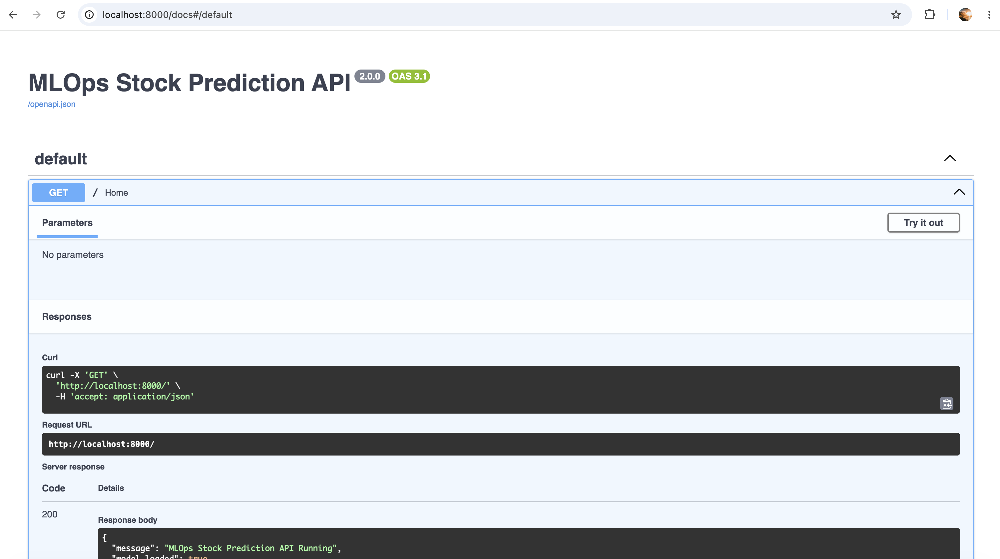
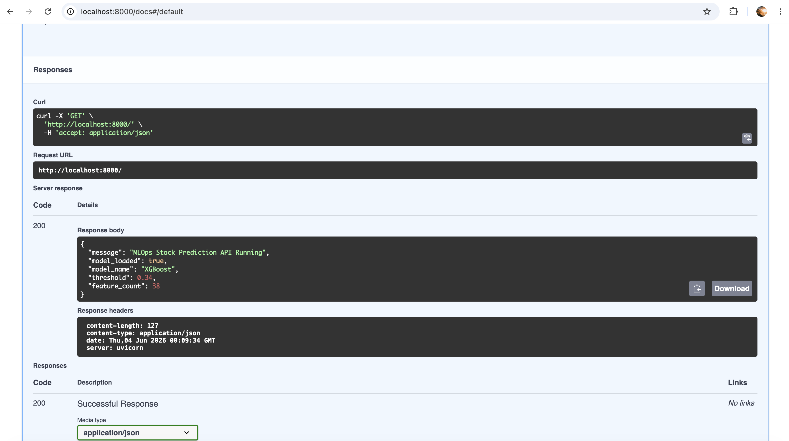
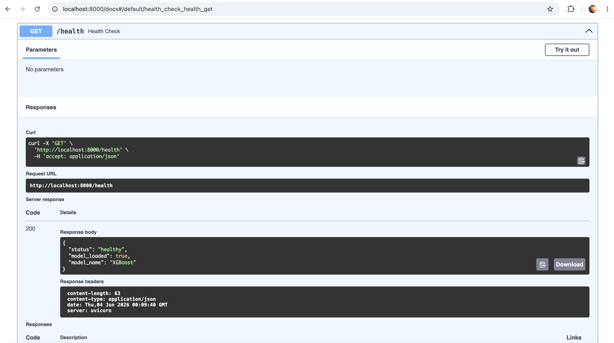
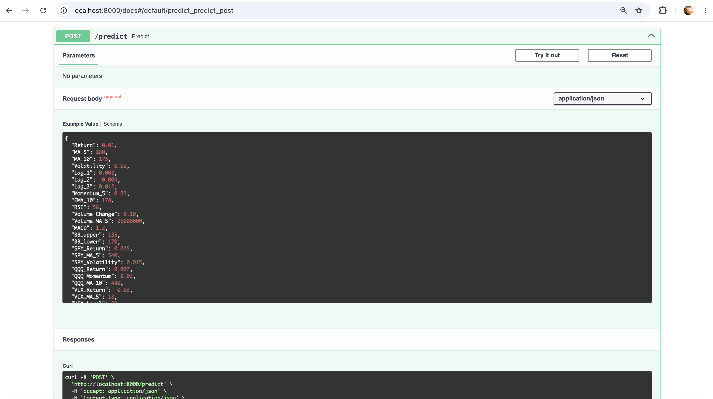
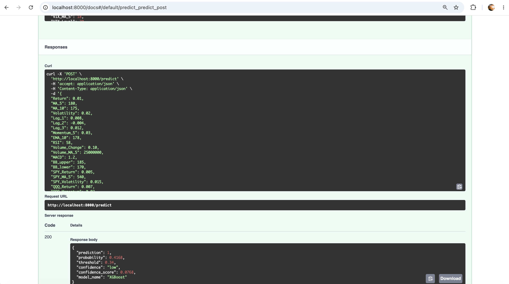
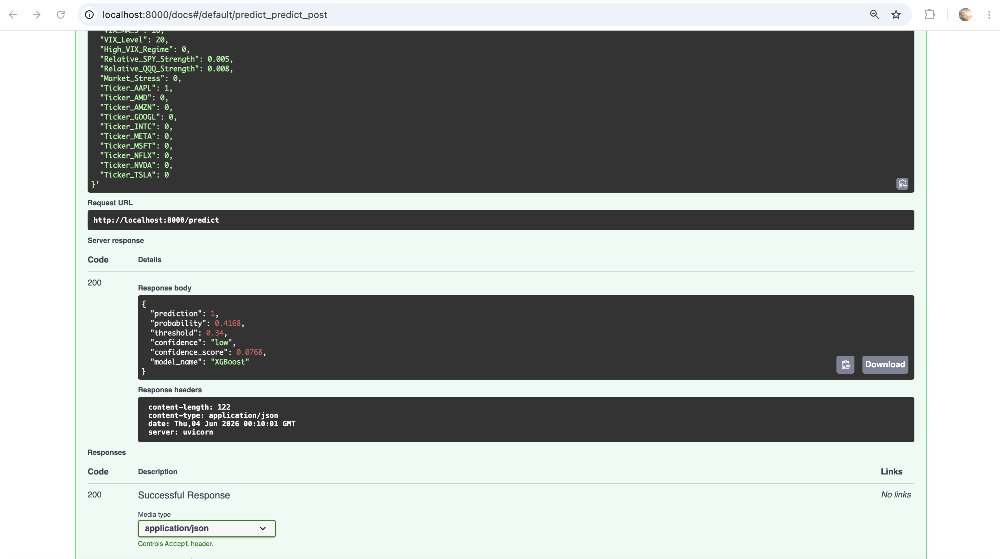
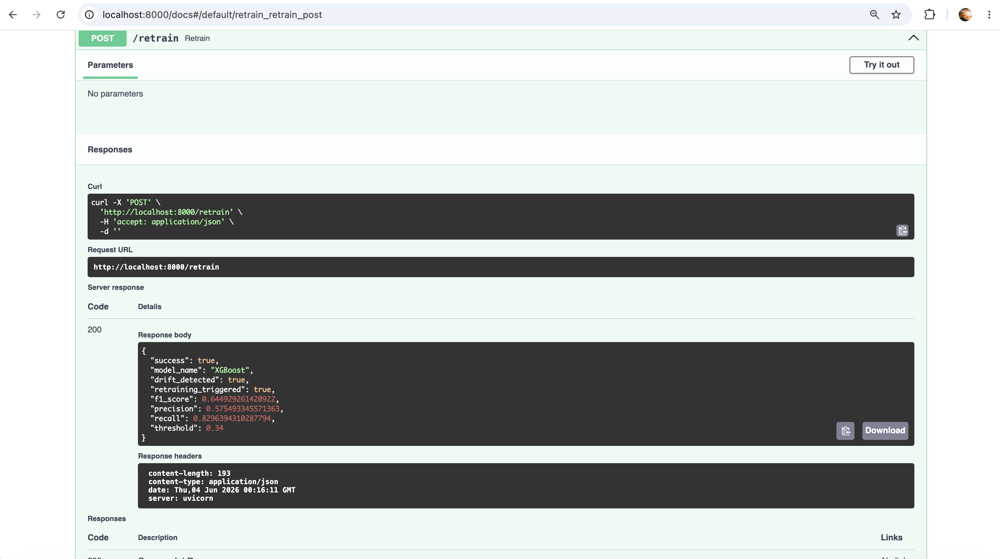

# API Deployment Report

## Overview

This report documents the deployment and validation of the FastAPI-based serving layer developed for the research project:

**Evaluating Model Drift and Retraining Strategies in an MLOps Pipeline for Stock Market Prediction**

The API provides a production-style interface for interacting with the trained machine learning model. It exposes endpoints for:

* Model status monitoring
* Health checks
* Real-time stock market predictions
* Drift-triggered retraining

The API serves as the deployment layer of the MLOps pipeline and demonstrates how machine learning models can be exposed as reusable services for downstream applications.

---

# API Architecture

The API was implemented using FastAPI and deployed locally using Uvicorn.

### Components

```text
Client
   │
   V
FastAPI Application
   │
   ├── GET /
   ├── GET /health
   ├── POST /predict
   └── POST /retrain
           │
           V
     XGBoost Model
           │
           V
 Monitoring & Drift Logic
```

The API loads the trained XGBoost model during startup and exposes prediction and retraining functionality through REST endpoints.

---

# Endpoint Summary

| Endpoint | Method | Purpose                             |
| -------- | ------ | ----------------------------------- |
| /        | GET    | API information and model metadata  |
| /health  | GET    | Health monitoring endpoint          |
| /predict | POST   | Generate stock movement predictions |
| /retrain | POST   | Trigger drift-aware retraining      |

---

# GET /

## Purpose

Provides basic API metadata and confirms that the trained model has been loaded successfully.

## Screenshot




## Example Response

```json
{
  "message": "MLOps Stock Prediction API Running",
  "model_loaded": true,
  "model_name": "XGBoost",
  "threshold": 0.34,
  "feature_count": 38
}
```

## Interpretation

The endpoint confirms:

* API availability
* Successful model loading
* Active classification threshold
* Number of engineered features

This provides operational visibility similar to production ML services.

---

# GET /health

## Purpose

Verifies service health and model readiness.

## Screenshot



## Example Response

```json
{
  "status": "healthy",
  "model_loaded": true,
  "model_name": "XGBoost"
}
```

## Interpretation

The endpoint confirms:

* API is operational
* Model artifact is available
* Predictions can be served

This endpoint would typically be used by orchestration systems and monitoring tools.

---

# POST /predict

## Purpose

Accepts engineered stock market features and returns a prediction.

## Screenshots





## Input Features

The endpoint receives the full engineered feature set including:

* Technical indicators
* Market momentum features
* Moving averages
* Volatility measures
* Relative strength metrics
* Regime indicators
* Ticker encodings

Total Features:

```text
38
```

## Example Response

```json
{
  "prediction": 1,
  "probability": 0.4168,
  "threshold": 0.34,
  "confidence": "low",
  "confidence_score": 0.0768,
  "model_name": "XGBoost"
}
```

## Interpretation

Prediction:

```text
1 = Bullish movement expected
```

Probability:

```text
41.68%
```

Decision Threshold:

```text
34%
```

Although the probability is below 50%, the model predicts class 1 because the optimized threshold discovered during training is 0.34.

This demonstrates an important machine learning deployment concept:

The optimal classification threshold is not always 0.50.

Threshold optimization improved model F1 performance and therefore became part of the deployed model configuration.

The confidence score provides additional transparency by indicating how strongly the prediction exceeds the threshold.

---

# POST /retrain

## Purpose

Simulates production monitoring by checking for drift and triggering model retraining when required.

## Screenshot



## Example Response

```json
{
  "success": true,
  "model_name": "XGBoost",
  "drift_detected": true,
  "retraining_triggered": true,
  "f1_score": 0.6449,
  "precision": 0.5755,
  "recall": 0.8296,
  "threshold": 0.34
}
```

## Interpretation

The monitoring system detected distribution changes in incoming data.

As a result:

* Drift was identified
* Retraining was executed
* A new model was generated
* Updated performance metrics were returned

This endpoint demonstrates automated model lifecycle management, a key MLOps capability.

---

# Prediction Workflow

```text
Input Features
      │
      V
Feature Validation
      │
      V
XGBoost Model
      │
      V
Probability Score
      │
      V
Threshold Comparison
      │
      V
Prediction Output
      │
      V
Confidence Calculation
```

The API returns both the prediction and supporting metadata to improve transparency and explainability.

---

# Retraining Workflow

```text
Monitoring Data
        │
        V
 Drift Detection
        │
        V
 Drift Found?
        │
   ┌────┴────┐
   │         │
  No        Yes
   │         │
   V         V
 Continue  Retrain
 Serving     Model
             │
             V
      Update Metrics
```

This workflow mirrors a real-world MLOps deployment where model performance is continuously monitored after deployment.

---

# Example Requests and Responses

## Health Check

Request

```http
GET /health
```

Response

```json
{
  "status": "healthy",
  "model_loaded": true
}
```

---

## Prediction

Request

```http
POST /predict
```

Response

```json
{
  "prediction": 1,
  "probability": 0.4168
}
```

---

## Retraining

Request

```http
POST /retrain
```

Response

```json
{
  "drift_detected": true,
  "retraining_triggered": true
}
```

---

# Validation Results

All endpoints were successfully tested through the FastAPI Swagger UI.

Validated functionality includes:

* Endpoint accessibility
* Model loading
* Prediction generation
* Confidence scoring
* Threshold-based classification
* Drift detection
* Automated retraining

No endpoint failures were observed during testing.

---

# Research Relevance

The API directly supports the research objectives.

### RQ1

How do different model drift detection and retraining strategies affect model performance over time?

The API exposes a retraining endpoint that operationalizes drift monitoring and allows performance evaluation after retraining events.

### RQ2

Does retraining on a schedule or only when drift is detected lead to better performance?

The API serves as the execution layer used to compare both retraining approaches.

### RQ3

What are the trade-offs between model accuracy and system complexity?

The API demonstrates the additional infrastructure required when introducing monitoring and automated retraining capabilities into a machine learning system.

---

# Conclusion

The FastAPI deployment successfully transformed the stock prediction model into a production-style machine learning service.

The API supports prediction serving, monitoring, confidence reporting, and automated retraining, demonstrating how MLOps practices can be integrated into an end-to-end machine learning workflow.

This deployment serves as the operational layer of the research pipeline and validates that monitoring and retraining strategies can be incorporated into a practical stock prediction system.
