# Docker Deployment Report

## Overview

This report documents the containerization and deployment of the Stock Market Prediction MLOps Pipeline using Docker.

Docker was integrated to provide a portable, reproducible, and platform-independent deployment environment for the machine learning application. The entire prediction API, trained model artifacts, drift detection components, retraining workflow, and monitoring functionality were packaged into a Docker image and executed within an isolated container environment.

The deployment demonstrates how modern MLOps systems can be reliably packaged and deployed across different environments without requiring manual dependency installation.

---

# Objectives

The primary objectives of Docker integration were:

* Package the entire application into a portable container
* Eliminate environment dependency issues
* Ensure reproducible deployments
* Enable rapid application startup
* Simplify API deployment
* Support future cloud deployment
* Demonstrate production-ready MLOps practices

---

# Docker Architecture

The Docker deployment contains:

```text
Docker Container
│
├── FastAPI Application
├── Trained ML Model
├── Feature Engineering Logic
├── Prediction Service
├── Drift Detection Module
├── Retraining Pipeline
├── Monitoring Reports
└── Supporting Dependencies
```

The container encapsulates all application components required for prediction and model lifecycle management.

---

# Dockerfile Configuration

A custom Dockerfile was created to package the application.

Major build steps include:

1. Pull Python base image
2. Install system dependencies
3. Copy project source code
4. Install Python requirements
5. Load trained model artifacts
6. Expose API port
7. Launch FastAPI service using Uvicorn

This process ensures a fully reproducible runtime environment.

---

# Docker Image Build

The application image was successfully built using Docker.

## Build Command

```bash
make docker-build
```

## Docker Build Process

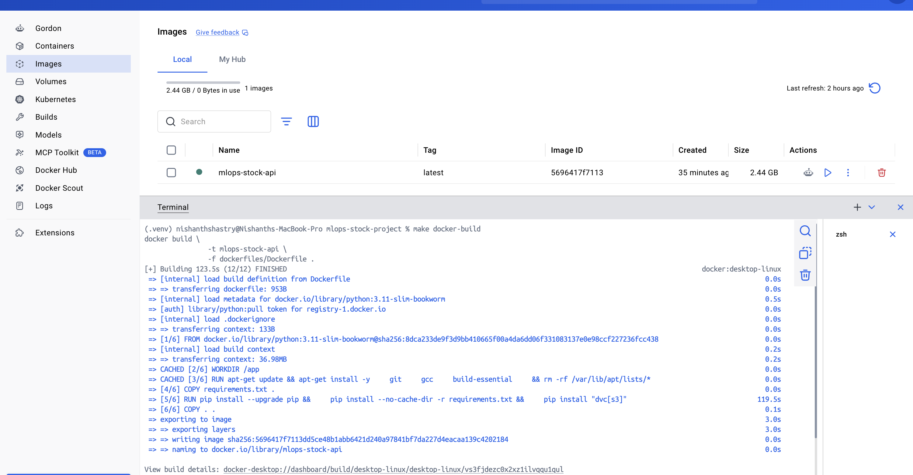

The build process completed successfully and generated the deployment image:

```text
mlops-stock-api:latest
```

---

# Docker Image Verification

After building, the Docker image was successfully registered in Docker Desktop.

## Image Verification

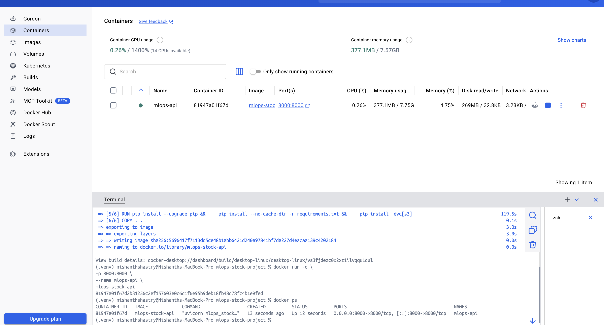

Image Details:

| Property   | Value           |
| ---------- | --------------- |
| Image Name | mlops-stock-api |
| Tag        | latest          |
| Size       | ~2.44 GB        |
| Status     | Available       |

The image contains all dependencies required to execute the complete MLOps workflow.

---

# Container Deployment

The image was deployed as a running Docker container.

## Deployment Command

```bash
docker run -d \
-p 8000:8000 \
--name mlops-api \
mlops-stock-api
```

## Running Container


The container successfully started and exposed the FastAPI service on:

```text
http://localhost:8000
```

---

# API Startup Verification

Application startup logs were inspected to verify successful initialization.

## Startup Logs

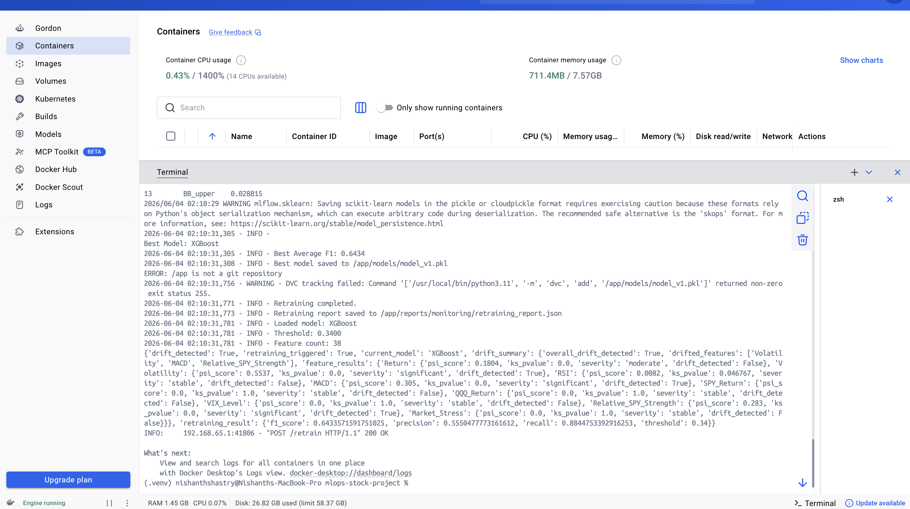

The logs confirm:

* FastAPI server startup
* Model loading
* Threshold loading
* Feature initialization
* Uvicorn service launch

Example log entries:

```text
Loaded model: XGBoost
Threshold: 0.3533
Feature count: 38
Application startup complete
```

This confirms the application was initialized successfully inside the Docker container.

---

# Root Endpoint Testing

The root endpoint was tested to verify API availability.

## Endpoint

```http
GET /
```

## Root Endpoint Response

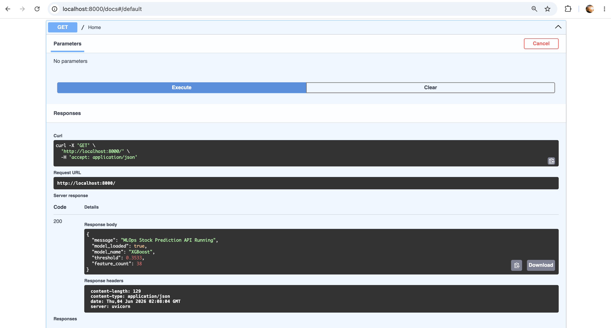

Response:

```json
{
  "message": "MLOps Stock Prediction API Running",
  "model_loaded": true,
  "model_name": "XGBoost",
  "threshold": 0.3533,
  "feature_count": 38
}
```

This confirms successful model loading and API readiness.

---

# Health Check Endpoint

A dedicated health endpoint was implemented to support production monitoring.

## Endpoint

```http
GET /health
```

## Health Check Validation

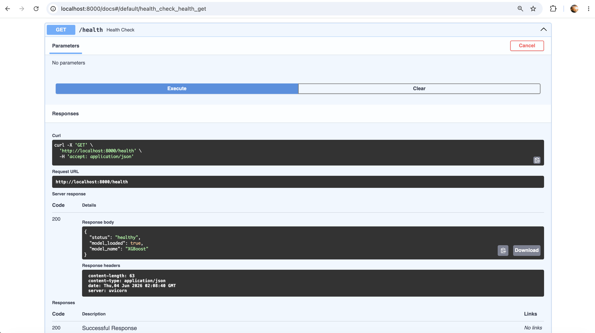

Response:

```json
{
  "status": "healthy",
  "model_loaded": true,
  "model_name": "XGBoost"
}
```

The health endpoint verifies that the API and model are functioning correctly.

---

# Prediction Endpoint Testing

The prediction endpoint was executed using sample stock market feature inputs.

## Endpoint

```http
POST /predict
```

## Prediction Request

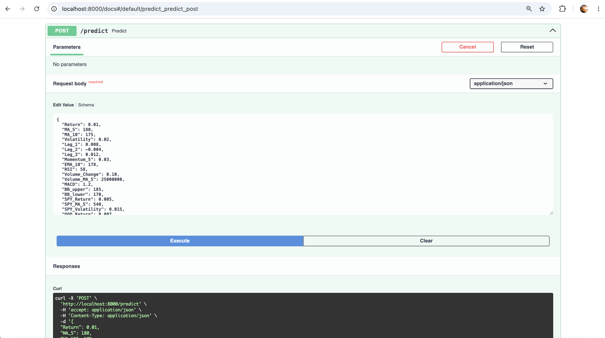

Example input features include:

* Return
* Moving Averages
* RSI
* MACD
* Bollinger Bands
* Volatility
* Market Stress Indicators

---

## Prediction Response

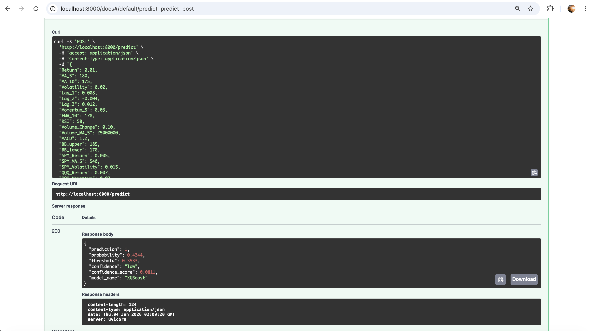

Response:

```json
{
  "prediction": 1,
  "probability": 0.4344,
  "threshold": 0.3533,
  "confidence": "low",
  "model_name": "XGBoost"
}
```

The successful response confirms that inference is operating correctly within the containerized environment.

---

# Retraining Endpoint Testing

One of the primary goals of the project is automated model retraining after drift detection.

The retraining workflow was tested directly inside the Docker container.

## Endpoint

```http
POST /retrain
```

## Retraining Response

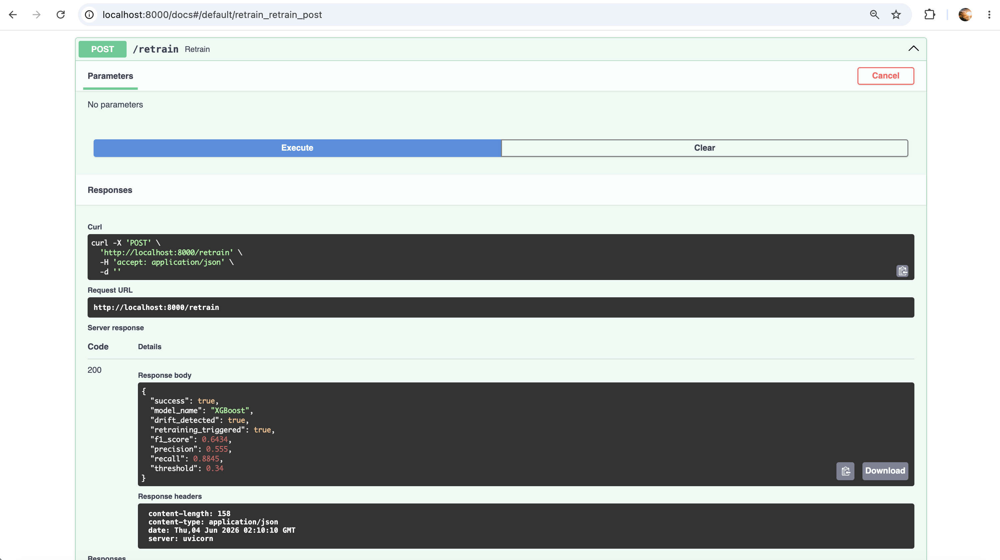

Response:

```json
{
  "success": true,
  "model_name": "XGBoost",
  "drift_detected": true,
  "retraining_triggered": true,
  "f1_score": 0.6434,
  "precision": 0.555,
  "recall": 0.8845,
  "threshold": 0.34
}
```

The API successfully detected drift and initiated retraining.

---

# Drift Detection Validation

Container logs show successful drift detection execution.

## Drift Detection Logs

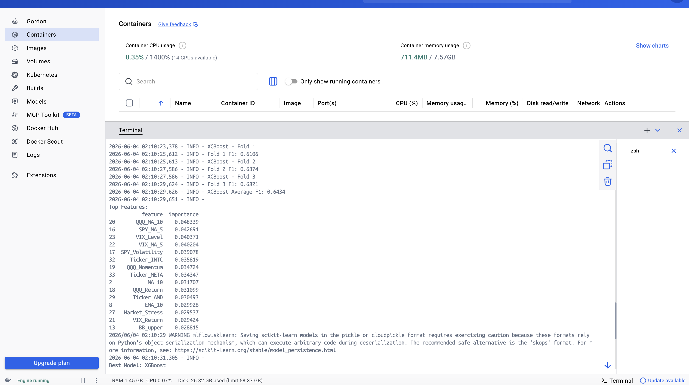

Detected drift features:

* Volatility
* MACD
* Relative_SPY_Strength

The monitoring system correctly identified distribution shifts in the data.

---

# Automated Retraining Execution

After drift detection, retraining was automatically triggered.

## Retraining Logs

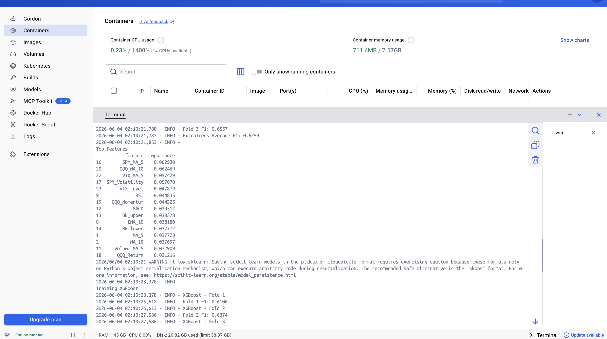

The workflow performed:

* Dataset loading
* Feature generation
* Time-series cross validation
* Model comparison
* Threshold optimization
* Model replacement

This demonstrates a complete MLOps retraining cycle inside Docker.

---

# Model Training Validation

The container logs show successful training and evaluation of multiple models.

## Logistic Regression Training

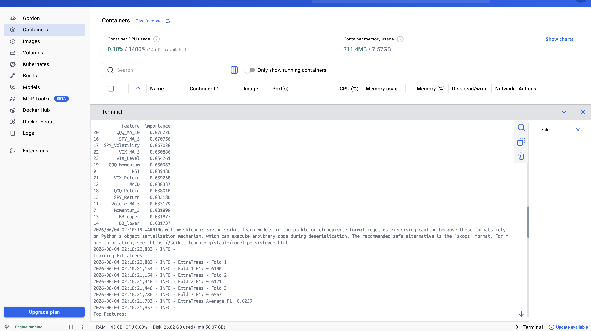

Average F1 Score:

```text
0.6111
```

---

## Random Forest Training


Average F1 Score:

```text
0.6330
```

---

## Extra Trees Training

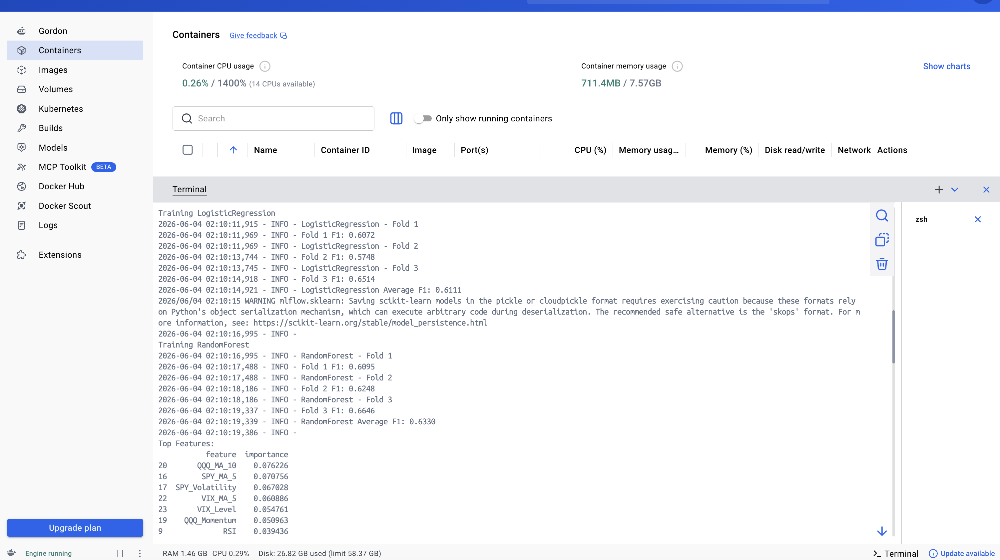

Average F1 Score:

```text
0.6259
```

---

## XGBoost Training

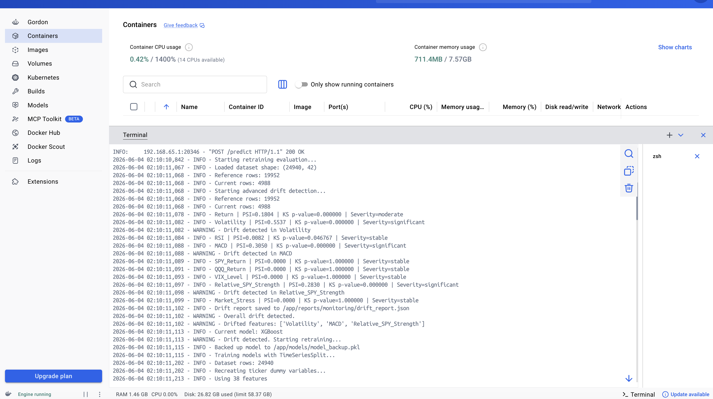

Average F1 Score:

```text
0.6434
```

XGBoost achieved the highest overall performance and was selected as the production model.

---

# Feature Importance Analysis

During retraining, feature importance metrics were generated.

## Feature Importance Output

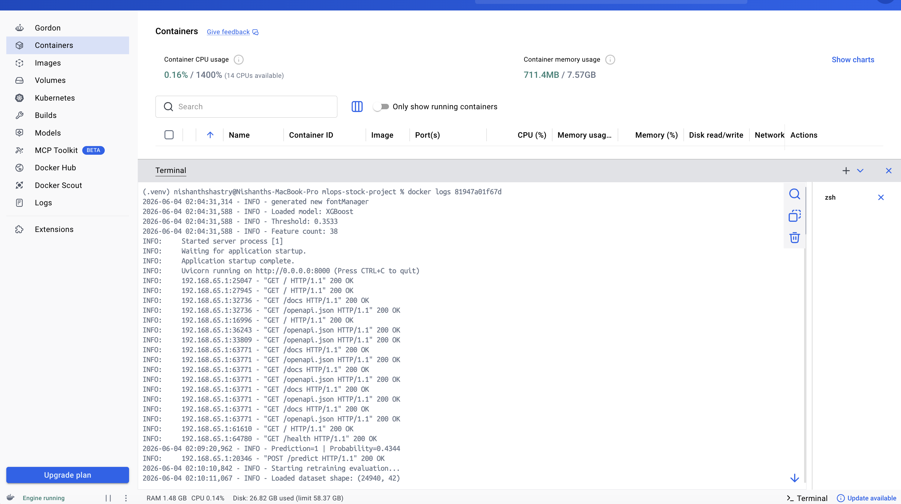

Top contributing features included:

* QQQ_MA_10
* SPY_MA_5
* VIX_MA_5
* SPY_Volatility
* VIX_Level

These indicators played a significant role in prediction performance.

---

# Container Log Monitoring

Docker logs were used to verify runtime behavior and application health.

The logs confirmed:

* API requests processed successfully
* Prediction requests executed correctly
* Drift detection triggered
* Retraining completed successfully
* No critical runtime failures occurred

This demonstrates operational observability within the containerized environment.

---

# Benefits of Docker Integration

The Docker deployment provides several advantages:

* Environment consistency
* Reproducible execution
* Simplified deployment
* Dependency isolation
* Easier testing
* Cloud deployment readiness
* Improved scalability

These benefits align closely with modern MLOps deployment practices.

---

# Validation Results

The Docker deployment successfully demonstrated:

- [x] Docker image creation
- [x] Container startup
- [x] API deployment
- [x] Health monitoring
- [x] Prediction serving
- [x] Drift detection
- [x] Automated retraining
- [x] Runtime logging
- [x] End-to-end MLOps workflow execution

No deployment failures were observed during testing.

---

# Conclusion

Docker was successfully integrated into the Stock Market Prediction MLOps Pipeline and enabled reproducible, containerized deployment of the complete machine learning system.

The deployment validated that model inference, drift detection, monitoring, retraining, and API services can operate reliably inside an isolated Docker environment. The successful execution of the full MLOps workflow demonstrates readiness for future deployment to cloud-native platforms such as Kubernetes, AWS ECS, Azure Container Apps, or Google Cloud Run.

Docker therefore serves as a critical foundation for transitioning the project from a development environment to a production-ready MLOps deployment architecture.
