# MLflow Experiment Tracking Report

## Overview

This report documents the integration of MLflow into the stock market prediction MLOps pipeline developed for the research project:

**Evaluating Model Drift and Retraining Strategies in an MLOps Pipeline for Stock Market Prediction**

MLflow was incorporated to provide centralized experiment management and reproducibility throughout the machine learning lifecycle. The platform was used to track training and retraining experiments, log evaluation metrics, store model artifacts, compare model performance, and maintain model version history.

The integration enables systematic evaluation of multiple machine learning models and supports the analysis of retraining strategies under simulated drift conditions.

---

## MLflow Architecture

MLflow was integrated directly into both the training and retraining workflows.

```text
Data Collection
      │
      V
Feature Engineering
      │
      V
Model Training
      │
      V
MLflow Tracking
      │
 ┌────┼────┐
 │    │    │
 V    V    V
Metrics Parameters Artifacts
      │
      V
Model Comparison
      │
      V
Model Registry
```

The tracking system records all experiment metadata required for model evaluation, comparison, and reproducibility.

---

## MLflow Setup

The MLflow user interface was launched locally using the following command:

```bash
make mlflow-ui
```

### MLflow Startup

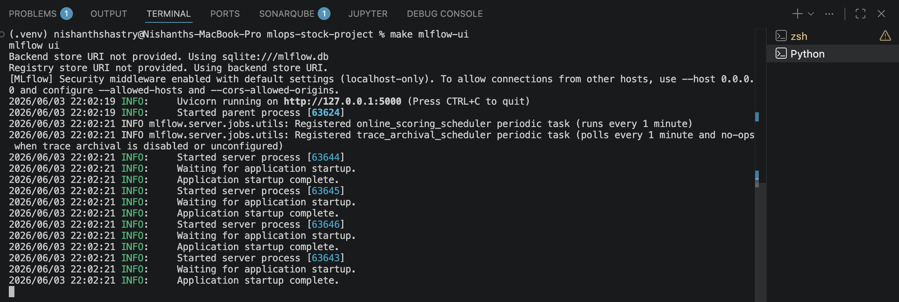

The tracking server successfully started on:

```text
http://127.0.0.1:5000
```

This interface provides centralized access to all experiments, runs, metrics, parameters, and artifacts generated throughout the project.

---

## Experiment Tracking

### Experiment Creation

A dedicated MLflow experiment named **mlops-stock-prediction** was created to organize all training and retraining runs.

### Experiment Dashboard

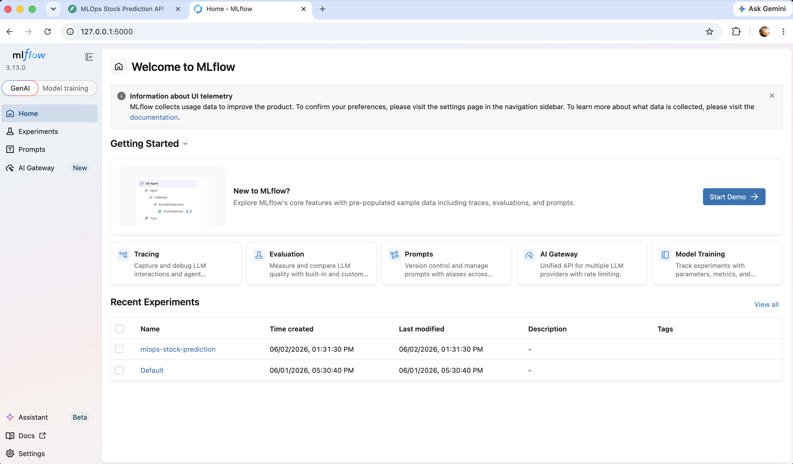

The experiment acts as the primary container for all model development activities.

---

### Training Run Tracking

Each model training execution generates a unique MLflow run.

Tracked models include:

* XGBoost
* Random Forest
* Extra Trees
* Logistic Regression

### Training Runs Overview

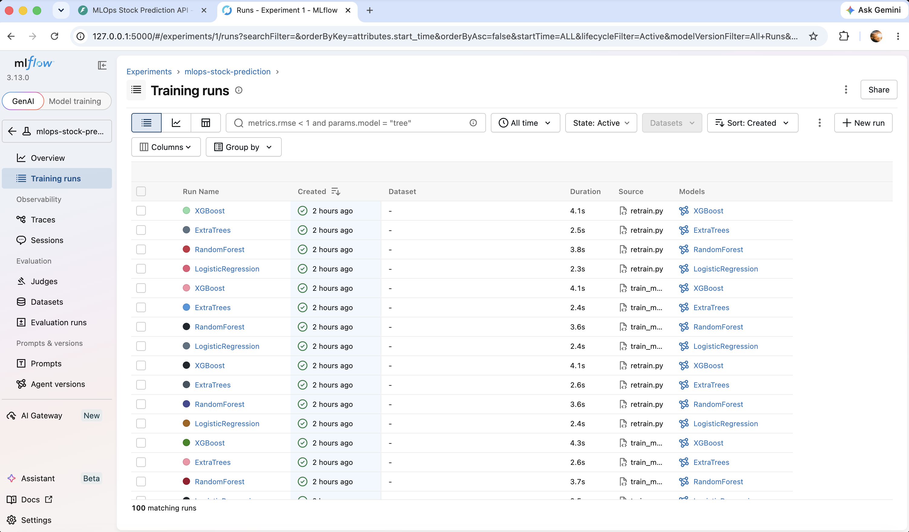

MLflow automatically records:

* Run name
* Timestamp
* Source script
* Model type
* Training duration
* Logged metrics
* Associated artifacts

This provides complete traceability of model development and evaluation.

---

### Retraining Run Tracking

Retraining events triggered by simulated data drift are also recorded as independent MLflow runs.

This enables comparison between:

* Initial training runs
* Scheduled retraining runs
* Drift-triggered retraining runs

The tracking history provides a complete view of model lifecycle management and supports longitudinal performance analysis.

---

## Metrics Logging

Key evaluation metrics were automatically logged during every model training and retraining execution.

Tracked metrics include:

* Average F1 Score
* Precision
* Recall
* Optimal Classification Threshold

### Model Metrics View

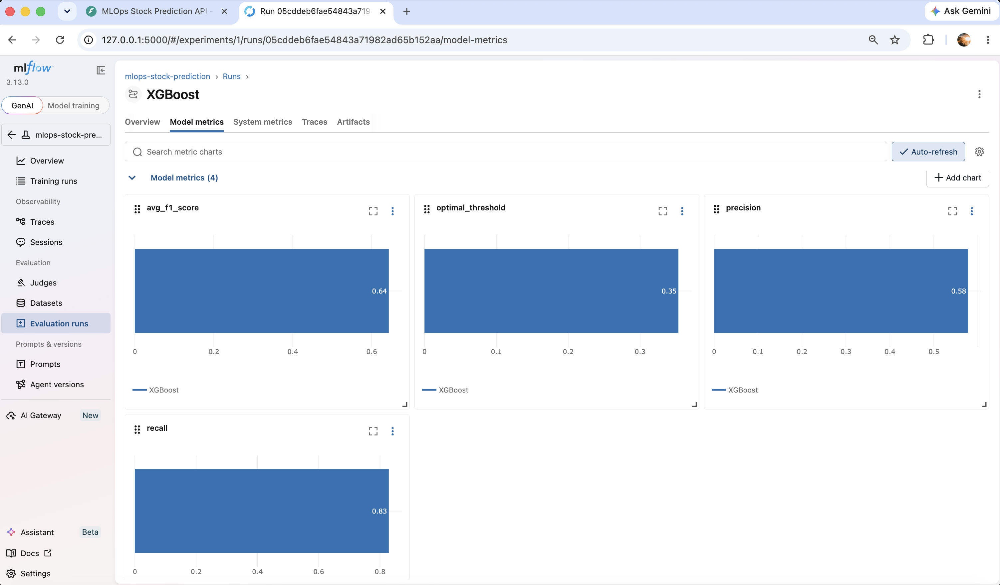

### Example XGBoost Metrics

| Metric            | Value |
| ----------------- | ----- |
| Avg F1 Score      | 0.643 |
| Precision         | 0.578 |
| Recall            | 0.829 |
| Optimal Threshold | 0.353 |

These metrics provide a consistent basis for evaluating model quality and comparing performance across experiments.

---

## Parameter Logging

MLflow also records model configuration information and training parameters.

### Metrics and Parameters

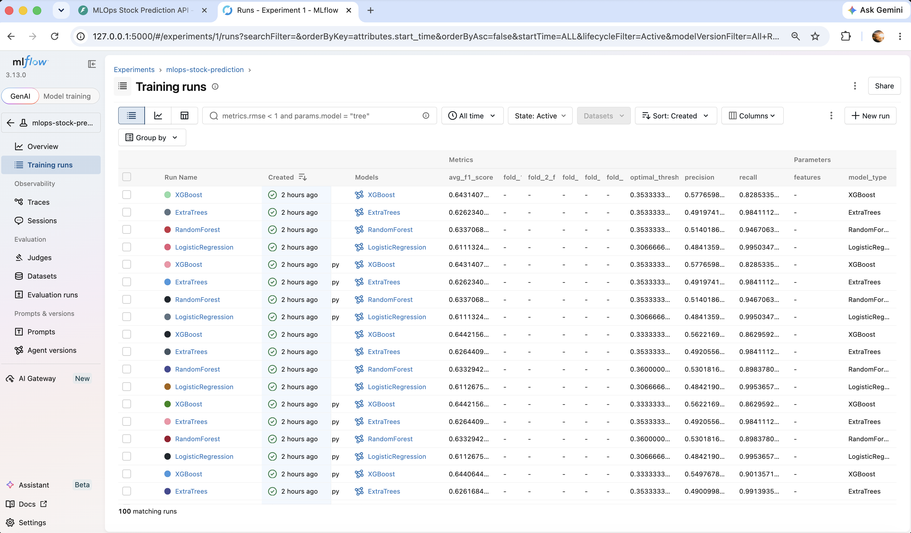

Example parameter recorded:

| Parameter  | Value   |
| ---------- | ------- |
| model_type | XGBoost |

Parameter logging improves reproducibility and enables future experimentation with alternative model configurations.

---

## Model Versioning

MLflow automatically maintains model lineage and version history.

### Model Versions

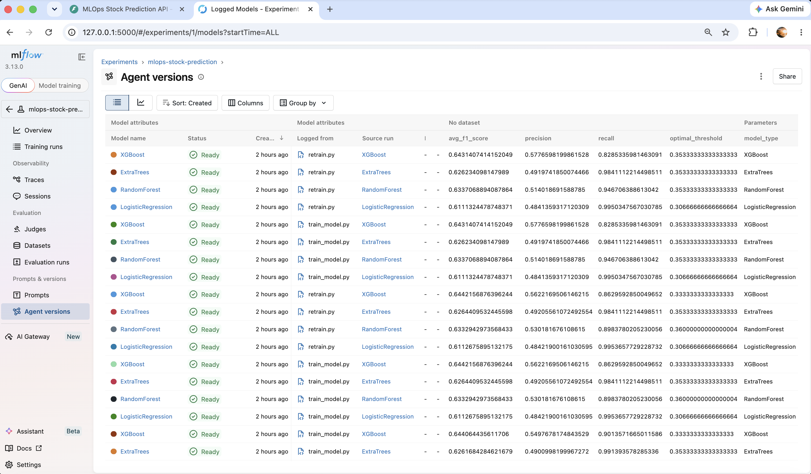

Each registered model version contains:

* Model name
* Creation timestamp
* Source run
* Training script
* Evaluation metrics
* Model status

This provides traceability between training runs and deployed model artifacts.

---

## Artifact Management

MLflow stores generated evaluation artifacts alongside each experiment run.

Artifacts are preserved automatically and can be retrieved for future analysis.

---

### Confusion Matrix Artifacts

The training pipeline logs confusion matrices for every model.

#### Random Forest Artifact

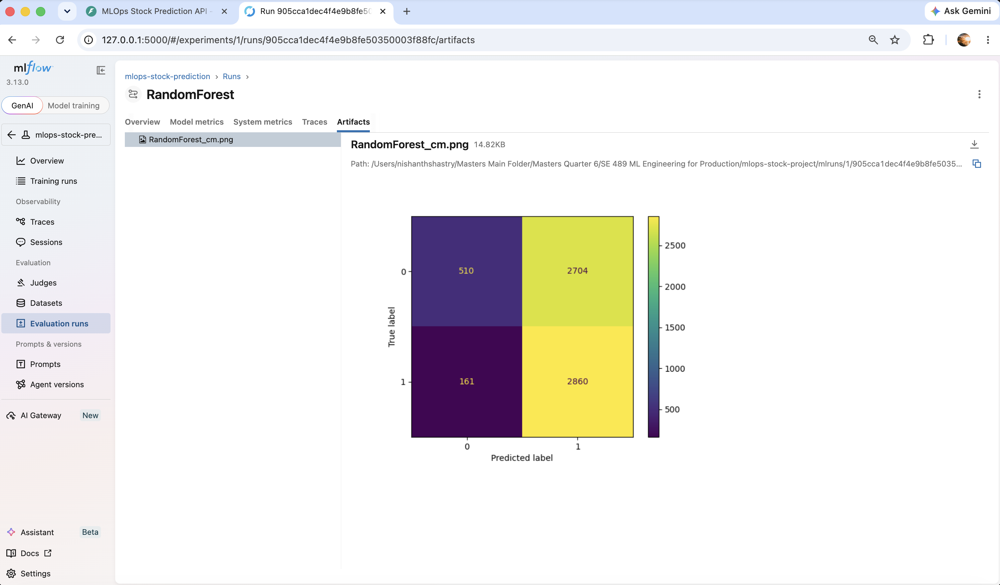

#### Logistic Regression Artifact

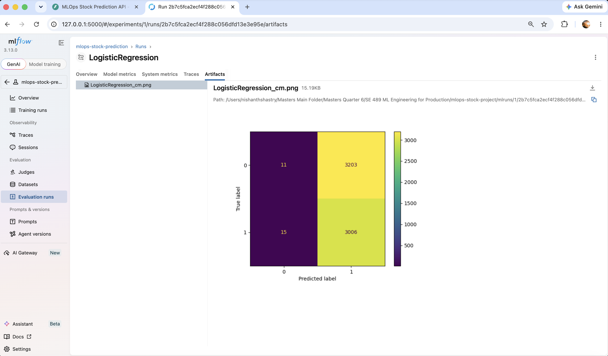

#### XGBoost Artifact

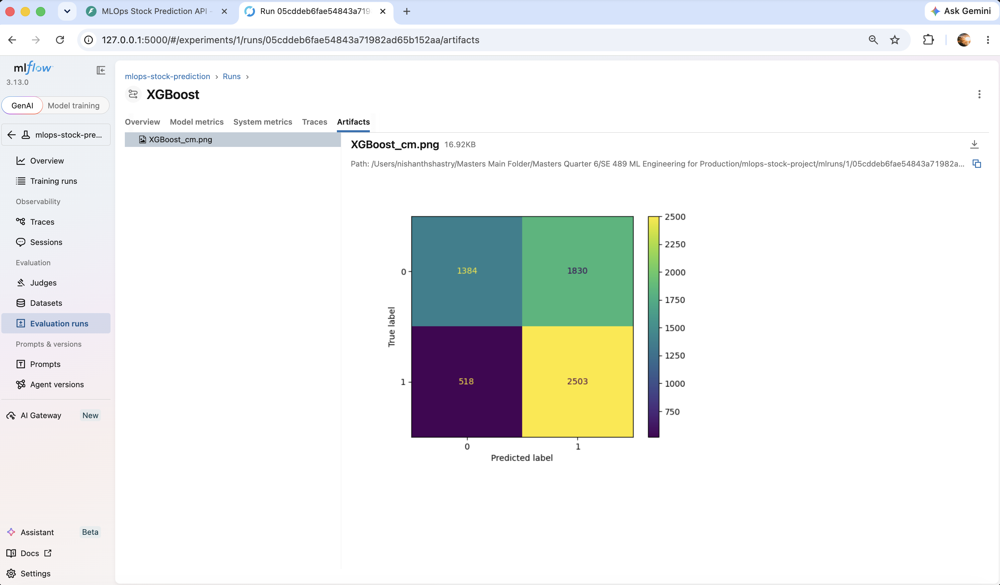

These artifacts support model validation and error analysis.

---

### Model Evaluation Artifacts

Artifact storage provides several benefits:

* Automated experiment documentation
* Reproducible research workflows
* Visual model diagnostics
* Historical model comparisons

MLflow centralizes all evaluation outputs and removes the need for manual artifact management.

---

## Model Comparison and Analytics

MLflow provides built-in visualization tools for comparing multiple models and runs.

### Analytics Dashboard

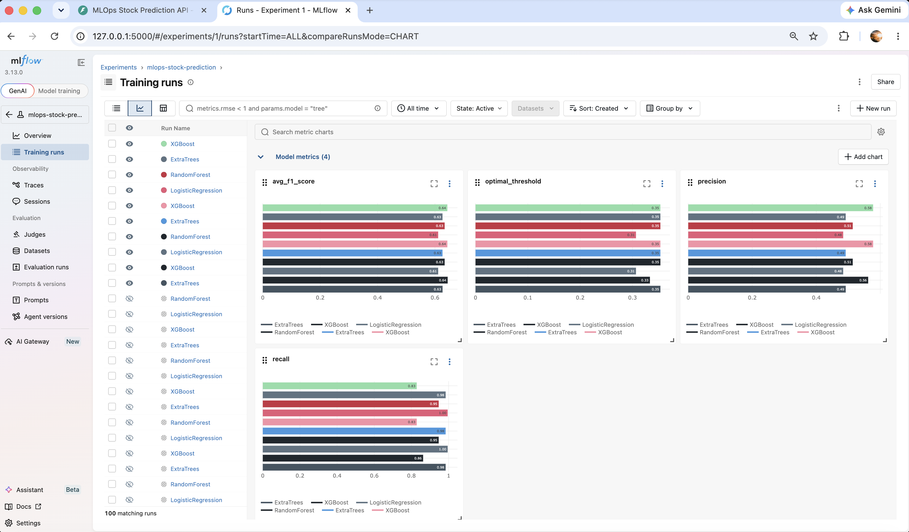

The analytics view allows direct comparison of:

* F1 Score
* Precision
* Recall
* Classification Threshold

across different models and retraining cycles.

This significantly simplifies model selection and performance monitoring.

---

## Reproducibility and Research Support

A key objective of this project is ensuring experiment reproducibility.

MLflow contributes to reproducibility by automatically storing:

* Source code references
* Training scripts
* Model parameters
* Evaluation metrics
* Generated artifacts
* Execution timestamps

### Run Overview

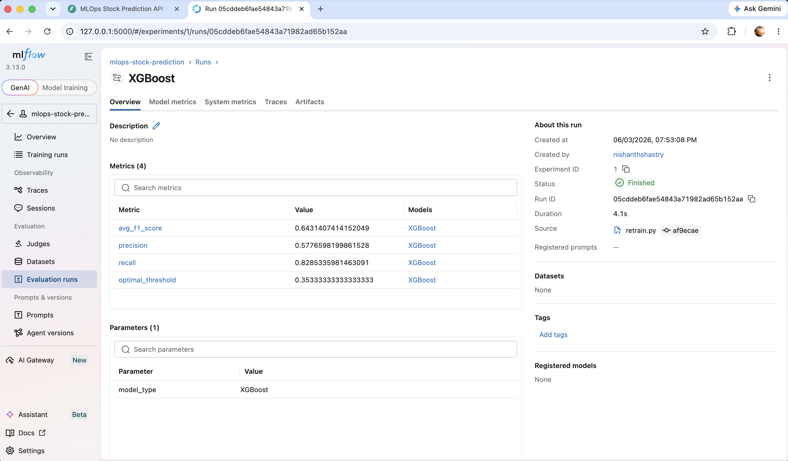

### Source and Metrics Tracking

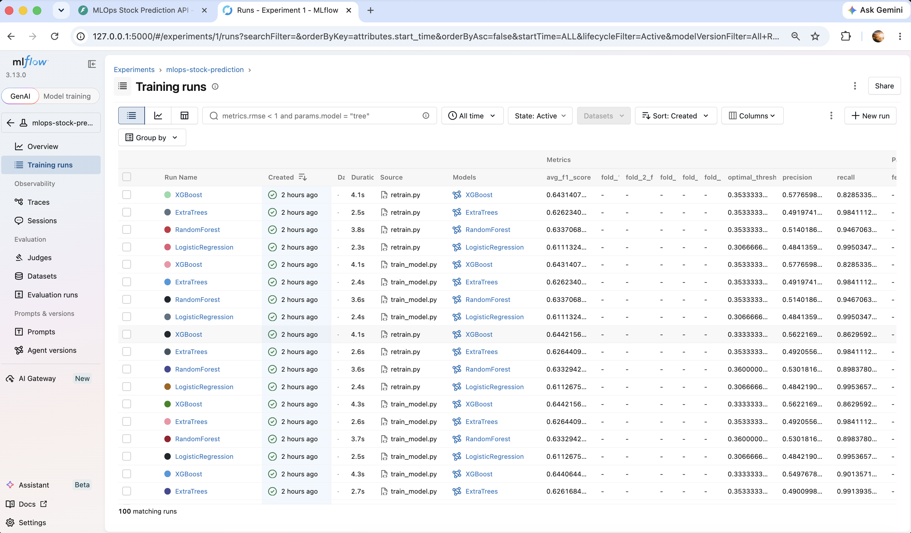

Using this information, any experiment can be reproduced and validated independently.

This capability is especially important in research-oriented machine learning systems.

---

## Validation Results

The MLflow integration successfully demonstrated the following capabilities:

* Experiment creation
* Run tracking
* Metric logging
* Parameter logging
* Artifact storage
* Model versioning
* Retraining experiment tracking
* Model comparison analytics

No experiment tracking failures were observed during testing.

---

## Research Relevance

The MLflow integration directly supports the research objectives of this project.

### Research Question 1

**How does model performance change after drift and retraining?**

MLflow stores metrics from every training and retraining run, enabling longitudinal performance analysis.

### Research Question 2

**Which retraining strategy performs best?**

The experiment tracking system allows direct comparison between baseline training, scheduled retraining, and drift-triggered retraining approaches.

### Research Question 3

**How can reproducibility be maintained in production machine learning systems?**

MLflow preserves complete experiment metadata and provides an auditable record of all model development activities.

---

## Conclusion

MLflow was successfully integrated into the stock prediction MLOps pipeline and provided comprehensive experiment tracking, metric logging, artifact management, and model versioning capabilities.

The platform improved reproducibility, simplified model comparison, and enabled systematic evaluation of retraining strategies under simulated drift conditions.

These capabilities are fundamental to modern MLOps workflows and directly support the research goal of evaluating model drift and retraining approaches in production-oriented machine learning systems.
